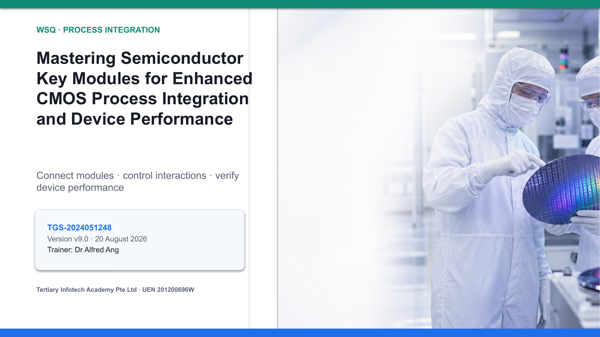

# Mastering Semiconductor Key Modules for Enhanced CMOS Process Integration and Device Performance

Highly visual two-day WSQ courseware for CMOS process modules, integration, device/reliability performance, SPC, packaging and future IC technologies.

## Package

- Master Trainer Slides (139-slide PPTX and PDF) rebuilt to the Master Mobile Photography reference design system.
- Five rights-safe Imagegen visuals plus aspect-safe legacy technical exhibits; no image is stretched to fit.
- Learner Guide (DOCX and PDF) with detailed step-by-step procedures.
- Lesson Plan (DOCX and PDF) aligned to the final slide map.
- Eight individual activity folders with printable Markdown/PDF resources.
- Excel workbooks for lithography/etch process-window analysis, Cp/Cpk, Xbar-R SPC and p-chart analysis.

## Activities

| # | Activity | Main alignment |
|---|---|---|
| 1 | Build a CMOS Process Module Map | LO1 · K1 · A1-A2 |
| 2 | Diagnose a Pattern-Transfer Process Window | LO1 · K1 · A2 |
| 3 | Balance Implantation and Thermal Budget | LO1 · K1 · A2-A3 |
| 4 | Integrate Film Deposition and CMP | LO1 · K1 · A2 · A4 |
| 5 | Review an STI Integration Flow | LO2 · A1-A2 · A4 |
| 6 | Analyse Yield and Process Capability | LO2 · K2 · A3-A4 |
| 7 | Respond to an SPC CD Excursion | LO2 · K2 · A3-A5 |
| 8 | Run a Future-Technology Integration Gate | LO2 · K1-K2 · A2-A5 |

Each folder contains a detailed guide, worksheet, checklist and evidence record, with same-basename PDF copies. Procedures stay in the Learner Guide and activity packs; the slides remain concept-led.

## Learner Use

1. Download the current courseware and `activities/` folder.
2. Follow the concept-led slides during class.
3. Use the Learner Guide and each activity folder for detailed procedures.
4. Complete the acceptance checklist and retain evidence before moving to the next activity.

## Distribution Boundary

This public repository contains learner-facing courseware only. Assessments, answer keys, credentials, references, build tooling and publication QA material are intentionally excluded.

## Course Page

https://www.tertiarycourses.com.sg/wsq-mastering-semiconductor-key-modules-for-enhanced-cmos-process-integration-and-device-performance.html

© Tertiary Infotech Academy Pte Ltd · UEN 201200696W
